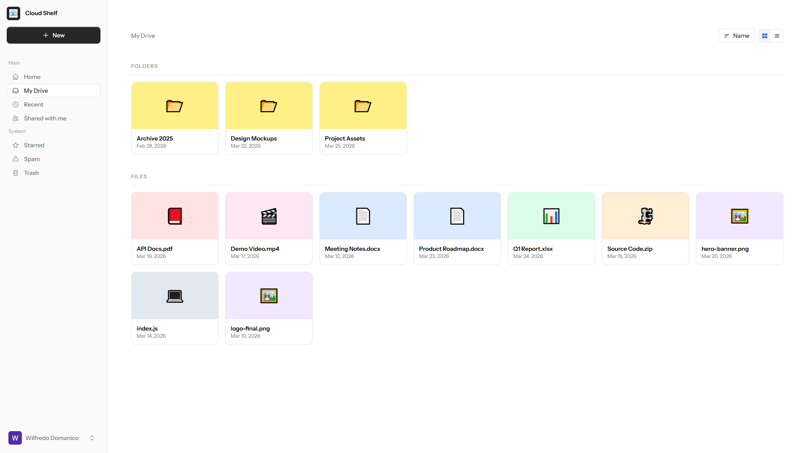
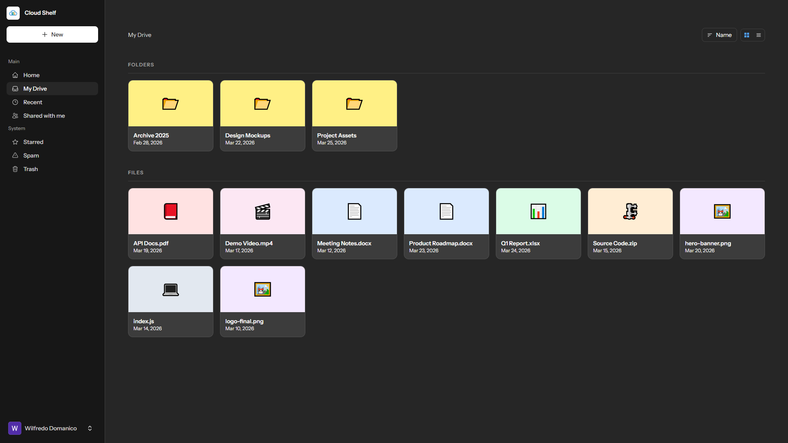

# ☁️ CloudShelf (Under Development)

CloudShelf is a modern cloud storage web application built with **Laravel** and **Livewire**, inspired by platforms like Google Drive. It allows users to upload, organize, manage, and share files in a clean and responsive interface.

---

## 📸 Screenshot

<p align="center">
  <table border="0">
    <tr>
      <td>
        
      </td>
      <td>
        
      </td>
    </tr>
  </table>
</p>

---

## 🚀 Features

- 📁 File & Folder Management (CRUD)
- ☁️ File Upload & Storage
- 🔍 Search & Filtering
- 🕒 Recent Files Tracking
- ⭐ Favorites / Starred Files
- 🔐 Authentication & Authorization
- 📤 File Sharing (optional/extendable)
- 🌙 Dark Mode UI
- ⚡ Reactive UI powered by Livewire (no heavy JS frameworks)

---

## 🛠️ Tech Stack

- **Backend:** Laravel
- **Frontend:** Blade + Livewire
- **Styling:** Tailwind CSS
- **Database:** MySQL / PostgreSQL
- **Storage:** Local / AWS S3 (configurable)
- **Auth:** Laravel Breeze / Jetstream (optional)

---

## 📦 Installation

### 1. Clone the repository

```bash
git clone https://github.com/your-username/cloudshelf.git
cd cloudshelf
```

### 2. Install dependencies

```bash
composer install
npm install && npm run dev
```

### 3. Setup environment

```bash
cp .env.example .env
php artisan key:generate
```

Update your `.env` file:

```env
DB_DATABASE=cloudshelf
DB_USERNAME=root
DB_PASSWORD=
```

### 4. Run migrations

```bash
php artisan migrate
```

### 5. Storage setup

```bash
php artisan storage:link
```

### 6. Start the server

```bash
php artisan serve
```

---

## 📁 Project Structure (Overview)

```
app/
 ├── Livewire/        # Livewire components (Drive UI logic)
 └── Models/          # Eloquent models (File, Folder, User)

resources/
 ├── views/
 │   ├── livewire/    # Component views
 │   ├── layouts/     # App layouts
 │   └── pages/       # Full page Livewire views
```

---

## 🧠 Core Concepts

### Livewire Components

CloudShelf heavily relies on Livewire for:

- Real-time UI updates
- File uploads without page reload
- State management

### File System

Files are stored using Laravel’s filesystem:

- Local storage (`storage/app/public`)
- Or cloud drivers like S3

---

## 🔐 Authentication

You can scaffold authentication using:

```bash
php artisan breeze:install livewire
php artisan migrate
npm run dev
```

---

## 📌 Future Improvements

- 📎 File sharing via links
- 🧑‍🤝‍🧑 Collaboration (multi-user folders)
- 🧠 AI-powered file tagging/search
- 📱 Mobile responsiveness enhancements
- 🔔 Notifications system
- 🗑️ Trash & file recovery

---

## 🧪 Testing

```bash
php artisan test
```

---

## 🧑‍💻 Contributing

Contributions are welcome!

1. Fork the project
2. Create a feature branch
3. Commit your changes
4. Push to your branch
5. Open a Pull Request

---

## 📄 License

This project is open-sourced under the MIT License.

---

## 💡 Inspiration

CloudShelf is inspired by modern cloud storage platforms like Google Drive, focusing on simplicity, speed, and developer-friendly architecture using Laravel Livewire.

---

> Built with ❤️ using Laravel & Livewire
